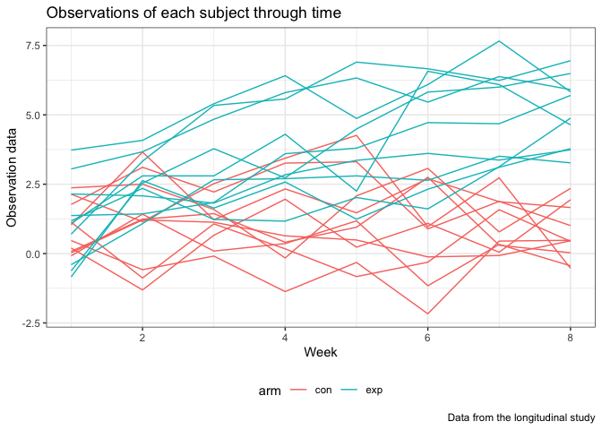
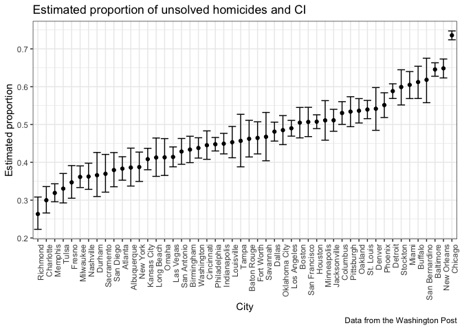

p8105\_hw5\_xz2788
================
Xiaoyue Zhang
11/2/2018

Load the necessary package

``` r
library(tidyverse)
```

    ## ── Attaching packages ───────────────────────────────────────────────── tidyverse 1.2.1 ──

    ## ✔ ggplot2 3.0.0     ✔ purrr   0.2.5
    ## ✔ tibble  1.4.2     ✔ dplyr   0.7.6
    ## ✔ tidyr   0.8.1     ✔ stringr 1.3.1
    ## ✔ readr   1.1.1     ✔ forcats 0.3.0

    ## ── Conflicts ──────────────────────────────────────────────────── tidyverse_conflicts() ──
    ## ✖ dplyr::filter() masks stats::filter()
    ## ✖ dplyr::lag()    masks stats::lag()

Problem 1
---------

First read in all file names into a dataframe

``` r
longidata = tibble(
  file_name = list.files(path = "./data")
)
```

Add in the data of each file to the dataframe and unnest the list

``` r
longidata$file = str_c('./data/',longidata$file_name)
longidata$data = map(longidata$file, read_csv)
longidata = unnest(longidata)
```

Tidy the dataset

``` r
longidata$file_name = str_replace(longidata$file_name, ".csv", "")
longidata = longidata %>% 
  select(-file) %>% 
  separate(file_name, into = c("arm", "subject_id"), sep = "_") %>% 
  gather(key = week, value = observation, week_1:week_8)
longidata$week = str_replace(longidata$week, "week_", "") %>% as.numeric()
longidata$arm = str_replace(longidata$arm, "con", "control")
longidata$arm = str_replace(longidata$arm, "exp", "experimental")
```

Check the resulting dataset to make sure it's tidy

``` r
head(longidata)
```

    ## # A tibble: 6 x 4
    ##   arm     subject_id  week observation
    ##   <chr>   <chr>      <dbl>       <dbl>
    ## 1 control 01             1        0.2 
    ## 2 control 02             1        1.13
    ## 3 control 03             1        1.77
    ## 4 control 04             1        1.04
    ## 5 control 05             1        0.47
    ## 6 control 06             1        2.37

``` r
str(longidata)
```

    ## Classes 'tbl_df', 'tbl' and 'data.frame':    160 obs. of  4 variables:
    ##  $ arm        : chr  "control" "control" "control" "control" ...
    ##  $ subject_id : chr  "01" "02" "03" "04" ...
    ##  $ week       : num  1 1 1 1 1 1 1 1 1 1 ...
    ##  $ observation: num  0.2 1.13 1.77 1.04 0.47 2.37 0.03 -0.08 0.08 2.14 ...

Make the required spaghetti plot

``` r
longidata$arm_id = str_c(longidata$arm, '_', longidata$subject_id)
#combine the "subject_id" and "arm" to make a new variable for later plotting

longidata %>% 
  ggplot(aes(x = week, y = observation, group = arm_id, color = arm)) +
  geom_line() +
  theme_bw() +
  labs(
    title = "Observations of each subject through time",
    x = "Week",
    y = "Observation data",
    caption = "Data from the longitudinal study"
  ) +
  theme(legend.position = "bottom")
```



Comment : From the sphaghetti plot, the observation data of experimental group are roughly higher than that of control group through 8 weeks and the difference between two groups became larger when time went by. However, we still need to consider the comparability of two groups at the beginning of the experiment and this can't be judged just by this plot.

Problem 2
---------

Read in the raw data of homicides and parse columns

``` r
homicide = read_csv(file = "./homicide-data.csv",
                    col_types = "cccccdcccddc")
```

### Description of raw data:

The "homicide" dataset in total have 52179 observations and 12 variables. Each observation is a homicide. Information includes the age, sex, name, race of the victim, date, city, state and location of the homicides as well as whether the homicide was closed. Except that age and location are numeric variables, others are character variables. Cases were counted as closed without arrest if they were reported by police to be “exceptionally cleared.”

Create a "city\_state" variable

``` r
homicide$city_state = str_c(homicide$city, ", ", homicide$state)
```

### Summarize within cities to get the total number of homicides

(here using "city" variable to group\_by, because the number of distinct cities is 50 which matches the total number of cities and this means there are no any two cities having the same name)

``` r
homicide %>% 
  group_by(city) %>% 
  summarize(n_homicide = n())
```

    ## # A tibble: 50 x 2
    ##    city        n_homicide
    ##    <chr>            <int>
    ##  1 Albuquerque        378
    ##  2 Atlanta            973
    ##  3 Baltimore         2827
    ##  4 Baton Rouge        424
    ##  5 Birmingham         800
    ##  6 Boston             614
    ##  7 Buffalo            521
    ##  8 Charlotte          687
    ##  9 Chicago           5535
    ## 10 Cincinnati         694
    ## # ... with 40 more rows

### Summarize within cities to get the unsolved cases

``` r
homicide %>% 
  filter(disposition %in% c("Closed without arrest", "Open/No arrest")) %>%
  group_by(city) %>% 
  summarize(n_unsolved = n())
```

    ## # A tibble: 50 x 2
    ##    city        n_unsolved
    ##    <chr>            <int>
    ##  1 Albuquerque        146
    ##  2 Atlanta            373
    ##  3 Baltimore         1825
    ##  4 Baton Rouge        196
    ##  5 Birmingham         347
    ##  6 Boston             310
    ##  7 Buffalo            319
    ##  8 Charlotte          206
    ##  9 Chicago           4073
    ## 10 Cincinnati         309
    ## # ... with 40 more rows

### For Baltimore

``` r
homicide %>% 
  filter(city == "Baltimore") %>% 
  group_by(disposition) %>% 
  summarize(n = n()) 
```

    ## # A tibble: 3 x 2
    ##   disposition               n
    ##   <chr>                 <int>
    ## 1 Closed by arrest       1002
    ## 2 Closed without arrest   152
    ## 3 Open/No arrest         1673

``` r
baltimore = prop.test(x = 1825, n = 2827)  
```

From the summary, there were in total 2827 homicides in Baltimore and 1825 were unsolved. Thus I used these two numbers as "x" and "n" to estimate the proportion.

``` r
broom::tidy(baltimore) %>% 
  janitor::clean_names() %>% 
  select(estimate, conf_low, conf_high)
```

    ## # A tibble: 1 x 3
    ##   estimate conf_low conf_high
    ##      <dbl>    <dbl>     <dbl>
    ## 1    0.646    0.628     0.663

Therefore, the estimated proportion of unsolved homicides in Baltimore is 64.56% and confidence interval is (0.6276, 0.6632).

### Estimate proportion in each city

First calculate the unsolved homicides and total homicides in each city

``` r
unsolved = homicide %>% 
  group_by(city, disposition) %>% 
  summarize(n = n()) %>% 
  filter(disposition %in% c("Closed without arrest", "Open/No arrest")) %>% 
  group_by(city) %>% 
  summarize(n_unsolved = sum(n))

total = homicide %>% 
  group_by(city) %>% 
  summarize(total = n())
```

Creat a function for prop\_test in each city

``` r
tidy_prop_test = function(x, n) {
  
  prop.test(x, n) %>% 
    broom::tidy() %>% 
    janitor::clean_names() %>% 
    select(estimate, conf_low, conf_high)
  
}
```

Creat a dataframe for estimating proportion and confidence interval for each city

``` r
prop_results = unsolved %>% 
  mutate(model = map2(.x = unsolved$n_unsolved, 
     .y = total$total, 
     ~tidy_prop_test(x = .x, n = .y))) %>% 
  unnest() %>% 
  select(-n_unsolved)
```

### Make a plot to show estimates and CIs for each city

``` r
prop_results %>% 
  transform(city = reorder(city, estimate)) %>% 
  ggplot(aes(x = city, y = estimate)) +
  geom_point() +
  geom_errorbar(aes(ymin = conf_low, ymax = conf_high)) +
  theme_bw() +
  theme(axis.text.x = element_text(angle = 90, hjust = 1)) +
  labs(
    title = "Estimated proportion of unsolved homicides and CI",
    x = "City",
    y = "Estimated proportion",
    caption = "Data from the Washington Post"
  )
```


