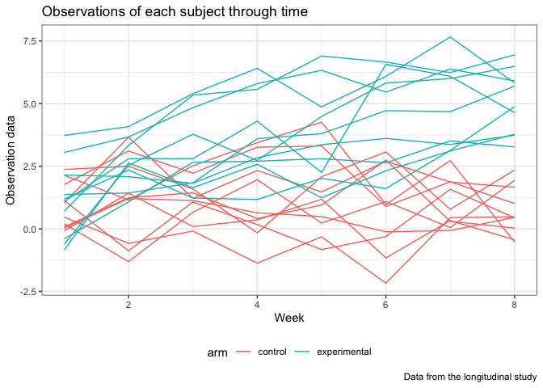

p8105\_hw5\_xz2788
================
Xiaoyue Zhang
11/2/2018

Load the necessary package

``` r
library(tidyverse)
```

    ## ── Attaching packages ───────────────────────────────────────────────── tidyverse 1.2.1 ──

    ## ✔ ggplot2 3.0.0     ✔ purrr   0.2.5
    ## ✔ tibble  1.4.2     ✔ dplyr   0.7.6
    ## ✔ tidyr   0.8.1     ✔ stringr 1.3.1
    ## ✔ readr   1.1.1     ✔ forcats 0.3.0

    ## ── Conflicts ──────────────────────────────────────────────────── tidyverse_conflicts() ──
    ## ✖ dplyr::filter() masks stats::filter()
    ## ✖ dplyr::lag()    masks stats::lag()

First read in all file names into a dataframe

``` r
longidata = tibble(
  file_name = list.files(path = "./data")
)
```

Add in the data of each file to the dataframe and unnest the list

``` r
longidata$file = str_c('./data/',longidata$file_name)
longidata$data = map(longidata$file, read_csv)
longidata = unnest(longidata)
```

Tidy the dataset

``` r
longidata$file_name = str_replace(longidata$file_name, ".csv", "")
longidata = longidata %>% 
  select(-file) %>% 
  separate(file_name, into = c("arm", "subject_id"), sep = "_") %>% 
  gather(key = week, value = observation, week_1:week_8)
longidata$week = str_replace(longidata$week, "week_", "") %>% as.numeric()
longidata$arm = str_replace(longidata$arm, "con", "control")
longidata$arm = str_replace(longidata$arm, "exp", "experimental")
```

Check the resulting dataset to make sure it's tidy

``` r
head(longidata)
```

    ## # A tibble: 6 x 4
    ##   arm     subject_id  week observation
    ##   <chr>   <chr>      <dbl>       <dbl>
    ## 1 control 01             1        0.2 
    ## 2 control 02             1        1.13
    ## 3 control 03             1        1.77
    ## 4 control 04             1        1.04
    ## 5 control 05             1        0.47
    ## 6 control 06             1        2.37

``` r
str(longidata)
```

    ## Classes 'tbl_df', 'tbl' and 'data.frame':    160 obs. of  4 variables:
    ##  $ arm        : chr  "control" "control" "control" "control" ...
    ##  $ subject_id : chr  "01" "02" "03" "04" ...
    ##  $ week       : num  1 1 1 1 1 1 1 1 1 1 ...
    ##  $ observation: num  0.2 1.13 1.77 1.04 0.47 2.37 0.03 -0.08 0.08 2.14 ...

Make the required spaghetti plot

``` r
longidata$arm_id = str_c(longidata$arm, '_', longidata$subject_id)
#combine the "subject_id" and "arm" to make a new variable for later plotting

longidata %>% 
  ggplot(aes(x = week, y = observation, group = arm_id, color = arm)) +
  geom_line() +
  theme_bw() +
  labs(
    title = "Observations of each subject through time",
    x = "Week",
    y = "Observation data",
    caption = "Data from the longitudinal study"
  ) +
  theme(legend.position = "bottom")
```


